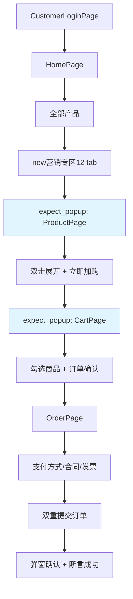

## 产品概述

基于 Playwright Codegen 录制代码 (`test_customer_order_recorded.py`) 重构客户下单全流程测试，使测试用例匹配真实业务操作路径。

## 核心功能

- **登录流程**：保持现有 CustomerLoginPage 不变（密码登录 → 我知道了 → 选公司）
- **产品导航**：点击"全部产品" → 选择 tab "new营销专区12"
- **产品详情页**（新窗口 popup）：双击展开按钮 → 填数量 → 立即加购
- **购物车**（新窗口 popup）：勾选商品复选框 → 订单确认 → 继续下单
- **订单确认页**：选择支付方式(先货后款) → 纸质合同(否) → 开票类型(明细) → 提交订单（两次点击）→ 等待成功弹窗

## 关键差异点（vs 当前代码）

| 阶段 | 当前代码 | 录制真实流程 |
| --- | --- | --- |
| 产品入口 | click_all_categories + select_marketing_zone("new营销专区12") | "全部产品"(first) → tab "new营销专区12" |
| 加购方式 | add_material() | 双击按钮 → 立即加购 |
| 购物车进入 | 点击购物车图标 | [popup 新窗口] 跳转 URL |
| 下单确认 | continue_order → assert_success | 支付方式+合同+发票 → 双重提交 → 弹窗确认 |
| 窗口模式 | 单页面 | 多 popup 新窗口 |


## 技术栈

- **框架**: Python 3.x + Pytest 7.4.0 + Playwright 1.38.0
- **架构**: Page Object Model (POM) + 分层架构
- **测试数据**: YAML 数据驱动 (新建 data/customer_order.yaml)
- **报告**: Allure (allure.step) + conftest 自动截图 hook

## 实现方案

### 整体策略

在现有页面对象上**增量补充方法**，不新建页面对象类。重写测试用例为单一端到端用例（参考录制代码的完整流程），保留原有分段用例作为回归。

### 核心设计决策

**1. Popup 多窗口处理**
录制代码显示产品详情页、购物车页均为 `expect_popup` 新窗口。采用 Playwright 的 `context.on("page")` 或 `page.expect_popup()` 模式。在页面对象中封装 `_wait_for_popup()` 方法处理窗口切换。

**2. HomePage 导航方法更新**

- 新增 `click_all_products()` 方法：对应录制 L17 `page.get_by_text("全部产品").first.click()`
- 修改 `select_marketing_zone()` 支持 tab 角色定位：L18 `page.get_by_role("tab", name="new营销专区12")`
- 保留旧方法向后兼容

**3. ProductPage 补充方法**

- `double_click_expand()`：对应 L22 双击 name=🛙 按钮
- `fill_quantity(quantity)` / `click_add_to_cart()`：加购流程
- `assert_product_code(code)` / `assert_total_price(expected)`：断言（可选）
- `open_detail_in_popup()`：处理 expect_popup 进入详情页

**4. CartPage 选择器更新与方法补充**

- 复选框选择器从通用 `PRODUCT_CHECKBOX_ALT` 更新为 `.content_solution_item .el-checkbox__original`（与录制一致）
- `check_first_item()`：JS 操作 checkbox + change 事件派发 + 最多3次重试
- `assert_total_amount(expected)`
- `click_continue_order()`：JS 查找"继续下单"文本点击

**5. OrderPage 大幅补充**

- `select_payment_method(method)`：如 "先货后款"
- `select_paper_contract(choice)`：如 "否"
- `select_invoice_type(type)`：如 "明细"
- `fill_remark(text)`：填写备注
- `scroll_page(ratio)` / `scroll_to_bottom()`
- `click_submit_order()`：双重提交逻辑
- `wait_for_dialog()` / `confirm_in_dialog()`：弹窗确认
- `wait_for_order_success()` / `assert_order_success()`

**6. 测试数据文件**
创建 `data/customer_order.yaml`：

```
login:
  phone: "18501375833"
  password: "123qwe"
  company: "上海燃气崇明有限公司"
product:
  quantity: 1
order:
  payment_method: "先货后款"
  paper_contract: "否"
  invoice_type: "明细"
```

### 架构设计



## 目录结构变更

```
f:\UI_AUTO/
├── pages/
│   ├── home_page.py              # [MODIFY] 新增 click_all_products, 更新 select_marketing_zone
│   ├── product_page.py           # [MODIFY] 新增 double_click_expand/click_add_to_cart/fill_quantity/open_detail_in_popup
│   ├── cart_page.py              # [MODIFY] 更新选择器为 .content_solution_item, 新增 check_first_item/assert_total_amount/click_continue_order
│   └── order_page.py             # [MODIFY] 大量新增: select_payment/select_contract/invoice/submit/dialog 等
├── tests/
│   └── test_customer_order.py    # [MODIFY] 重写主用例为完整端到端流程, 保留旧用例标记 regression
├── data/
│   └── customer_order.yaml       # [NEW] 客户下单测试数据
└── utils/
    └── logger.py                 # 不变
```

## 实现注意事项

- **Popup 窗口管理**：Playwright 的 `page.expect_popup()` 返回新 Page 对象，需要在 BasePage 封装通用 popup 等待方法
- **Element UI 渲染等待**：购物车和订单确认页使用 Element UI 组件，录制中使用了 wait_for_timeout，需评估替换为 `wait_for_load_state('networkidle')` 或显式元素等待
- **GBK 编码约束**：禁止 ✓ ✗ 等特殊字符在日志/断言消息中使用
- **POM 强约束**：测试用例中禁止直接调用 page.locator/page.fill/page.click，所有操作通过页面对象方法
- **向后兼容**： HomePage 的 `click_all_categories()` 和 `select_marketing_zone()` 旧方法保留不删除

## Agent Extensions

- **code-explorer**
- Purpose: 深度探索现有页面对象中各方法的调用关系、选择器定义模式、BasePage 已有工具方法
- Expected outcome: 确认 BasePage 中是否有可复用的 popup/多页面切换方法，避免重复实现