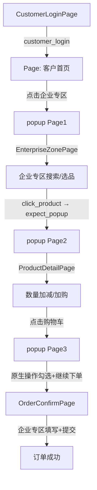

## 用户需求

将录制的"客户企业专区下单流程"Playwright Codegen 脚本整合到现有 POM 框架中。登录和订单确认页复用现有对象，企业专区和产品详情部分需新建页面对象。

## 核心功能

- 新建 `EnterpriseZonePage` 页面对象：封装企业专区搜索、产品选择（含 popup 切换）
- 新建 `ProductDetailPage` 页面对象：封装商品数量增减、立即加购操作
- 增强 `OrderConfirmPage`：添加"控制端"选择、备注填写方法
- 创建 `test_customer_enterprise.py` 测试文件，风格对齐现有 `test_customer_order_recorded.py`
- 更新 `pages/__init__.py` 导出新增页面对象

## 技术栈

- Python 3.x + Playwright (sync_api)
- 现有 POM 框架（BasePage 基类 + 页面对象继承模式）
- pytest + pytest-playwright 插件

## 架构设计

### 新增页面对象架构



### 模块划分

1. **EnterpriseZonePage** (新建)

- 定位器：搜索输入框、搜索按钮、产品列表项
- `open(page)` → 静态工厂方法，从首页 page 打开企业专区 popup
- `search_product(keyword)` → 搜索产品
- `click_product(name)` → 点击产品名称，返回新 popup 的 Page 对象

2. **ProductDetailPage** (新建)

- 定位器：数量+按钮、立即加购按钮
- `increase_quantity(times)` → 多次点击数量+按钮
- `click_add_to_cart()` → 点击"立即加购"
- `go_to_cart(page)` → 静态方法，从当前 page 打开购物车 popup

3. **OrderConfirmPage** (增强)

- 新增 `select_source_end(option)` → 选择控制端/供应商端
- 新增 `fill_remark(text)` → 填写备注 textarea
- 新增 `fill_enterprise_zone_order(remark_text)` → 企业专区一站式填写

4. **test_customer_enterprise.py** (新建)

- 独立 `sync_playwright` 风格（对齐 test_customer_order_recorded.py）
- 登录 → 导航企业专区 → 搜索加购 → 购物车 → 订单确认 → 提交

### 数据流

Page 对象传递链：`login_page.page` → `popup Page1` → `EnterpriseZonePage(Page1)` → `popup Page2` → `ProductDetailPage(Page2)` → `popup Page3` → `OrderConfirmPage(Page3)`

## 实现细节

### 目录结构

```
f:/UI_AUTO/
├── pages/
│   ├── __init__.py               # [MODIFY] 添加 EnterpriseZonePage、ProductDetailPage 导出
│   ├── base_page.py              # [复用] 基类，无需修改
│   ├── customer_login_page.py    # [复用] 客户登录，无需修改
│   ├── order_confirm_page.py     # [MODIFY] 新增 select_source_end、fill_remark、fill_enterprise_zone_order
│   ├── enterprise_zone_page.py   # [NEW] 企业专区搜索与产品选择
│   └── product_detail_page.py    # [NEW] 产品详情页数量操作与加购
└── tests/
    └── test_customer_enterprise.py # [NEW] 客户企业专区下单测试
```

### 关键代码结构

**EnterpriseZonePage** 核心方法签名：

```python
class EnterpriseZonePage(BasePage):
    """企业专区页面对象，封装搜索和产品选择操作"""
    
    @staticmethod
    def open(home_page: Page) -> tuple["EnterpriseZonePage", Page]:
        """从首页打开企业专区 popup，返回 (page_obj, popup_page)"""
        ...

    def search_product(self, keyword: str) -> "EnterpriseZonePage":
        """搜索产品关键字"""
        ...

    def click_product(self, product_name: str) -> Page:
        """点击产品名称，返回新 popup 的 Page 对象"""
        ...
```

**ProductDetailPage** 核心方法签名：

```python
class ProductDetailPage(BasePage):
    """产品详情页面对象，封装数量调整和加购操作"""
    
    def increase_quantity(self, times: int = 1) -> "ProductDetailPage":
        """点击数量+按钮指定次数"""
        ...

    def click_add_to_cart(self) -> "ProductDetailPage":
        """点击立即加购按钮"""
        ...

    @staticmethod
    def go_to_cart(page: Page) -> Page:
        """从当前 page 打开购物车 popup，返回购物车 Page"""
        ...
```

**OrderConfirmPage** 新增方法：

```python
def select_source_end(self, option: str = "控制端") -> "OrderConfirmPage":
    """选择来源端（控制端/供应商端）"""
    ...

def fill_remark(self, text: str) -> "OrderConfirmPage":
    """填写订单备注 textarea"""
    ...

def fill_enterprise_zone_order(self, remark: str = "") -> "OrderConfirmPage":
    """企业专区一站式订单填写：先货后款→否→控制端→备注→提交"""
    ...
```

### 性能与可靠性

- popup 处理使用 `expect_popup()` 带合理超时（5000ms），避免竞态条件
- 所有交互复用 BasePage 的自动等待机制，无 `time.sleep` 裸等待
- 企业专区搜索后添加 `wait_for_network_idle` 确保结果加载完成
- 数量加减按钮使用 `first` 定位器确保精确定位